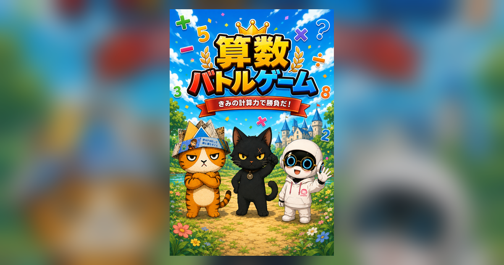

<div align="center">

# さんすうバトル！ フテ猫 vs クロネコさん



小学1〜3年生の算数を、フテ猫・クロネコさん・チャッピーちゃんと<br>
一緒にバトル形式で練習できるブラウザゲームです。

### ▶ あそぶ

## **<https://ganapati0330.github.io/sansu-battle/>**

リポジトリ　<https://github.com/ganapati0330/sansu-battle>

</div>

---

- **単一HTMLファイル**。画像・音・データはすべて内蔵、外部依存なし
- **完全オフライン動作**。サーバーもインターネット接続も不要
- **PWA対応**。ホーム画面に追加すればアプリのように起動、電波がなくても遊べます
- **きょうだいで別々に記録**。最大4人まで、成績も苦手問題も分けて保存
- スマートフォン・タブレット・PCどれでも動作

## もくじ

- [あそびかた](#あそびかた)
- [プレイヤー（きょうだいで べつべつに記録）](#プレイヤーきょうだいで-べつべつに記録)
- [キャラクターの配役](#キャラクターの配役)
- [おたすけ（ピンチのときの1回）](#おたすけピンチのときの1回)
- [ふくしゅう（まちがえた問題の記録）](#ふくしゅうまちがえた問題の記録)
- [にがて分析](#にがて分析)
- [きろくの ほぞん・ひきつぎ](#きろくの-ほぞんひきつぎ)
- [端末をまたいで引きつぐ](#端末をまたいで引きつぐ)
- [むずかしさ＝学年のまざり具合](#むずかしさ学年のまざり具合)
- [収録ジャンル](#収録ジャンル)
- [音について](#音について)
- [アプリとして つかう（PWA）](#アプリとして-つかうpwa)
- [ファイル構成](#ファイル構成)
- [公開のしかた](#公開のしかた)
- [GitHub Pages へ公開する](#github-pages-へ公開する)
- [技術メモ](#技術メモ)
- [ライセンス](#ライセンス)
- [リンク集](#リンク集)

---

## あそびかた

1. プレイヤーをえらび、むずかしさ・**みちのりのながさ**・ジャンルをえらぶ
2. バトルがはじまると、目的地までの道のりが出ます
3. **正かい＝1マスすすむ。まちがえた・時間ぎれ＝すすめない**

   あいてのキャラは道の少し先で待ちかまえていて、まちがえるとサッと目の前に回りこんで通せんぼします。
   正かいすると、あいてはあわてて先へ下がります。
4. 決められた問題数のうちに目的地に着けば勝ちです

### みちのりのながさ

といた問題の数がそのまま変わります。

| | ゴールまで | 出題の上限 | まちがえていい回数 |
| --- | --- | --- | --- |
| ちかい | 8マス | 11もん | 3かい |
| ふつう | 12マス | 16もん | 4かい |
| とおい | 16マス | 21もん | 5かい |

画面には「あと 8マス／まちがえて いいのは あと 3かい」と常に出ます。
のこり回数がなくなると赤くなります。

星は、まちがえた回数で決まります。0回なら★★★、2回までなら★★です。

## プレイヤー（きょうだいで べつべつに記録）

タイトル画面と、ジャンル選択画面の上部にあるプレイヤーバッジから切りかえられます。

- 最大4人まで登録できます
- なまえ（8文字まで）とアイコン（フテ猫／クロネコさん／チャッピーちゃん）を設定できます
- **にがて問題も成績も、プレイヤーごとに完全に分かれて保存されます**
- 「きろくを けす」で消えるのは、いま選んでいるプレイヤーの分だけです

以前のバージョンから更新した場合、それまでの記録は自動的に1人目のプレイヤーに引きつがれます。

## キャラクターの配役

プレイヤーのアイコンで、バトルの配役が変わります。

| えらんだアイコン | みかた | あいて | ヒント・かいふく |
| --- | --- | --- | --- |
| フテ猫 | フテ猫 | クロネコさん | チャッピーちゃん |
| クロネコさん | クロネコさん | フテ猫 または チャッピーちゃん | のこりの1人 |
| チャッピーちゃん | チャッピーちゃん | フテ猫 または クロネコさん | のこりの1人 |

フテ猫を選んだときは、これまで通りクロネコさんが相手です。
それ以外を選んだときは、相手がバトルごとにランダムで入れかわります。

相手のセリフ・声の高さ・表情、体力バーの名前、結果画面のコメントもすべて配役に合わせて変わります。

## おたすけ（ピンチのときの1回）

のこりの問題数だけでは目的地にとどかなくなったとき、司会のキャラが1回だけ後ろから押してくれて1マス進みます。

- 自力でまだ間にあうあいだは発動しません
- 1回のバトルにつき1回だけです
- 「もう無理かも」という場面から巻きかえせる、最後のチャンスです

## ふくしゅう（まちがえた問題の記録）

まちがえた問題は自動で端末に保存され、あとから何回でも解きなおせます。

- 選択画面の一番上に **ふくしゅう** カードがあり、たまっている問題数と、まちがえた回数の多い順に上位5問が表示されます
- 「にがてな もんだいに ちょうせん」を選んで **バトル スタート** で復習バトル（最大10問）
- 出題順は **まちがえた回数が多い順 → 記録が古い順**
- **2回続けて正解すると「マスター」** になり、リストから消えます
- 結果画面の「にがてを ふくしゅうする」からも直接入れます
- 「きろくを ぜんぶ けす」でリセットできます（確認ダイアログあり）

保存は `localStorage`（キー: `sansu-battle.v1.miss`、最大200問）を使います。保存が使えないブラウザ設定の場合は、その旨を表示したうえでその場かぎりの記録として動作します。

## にがて分析

タイトル画面・選択画面・結果画面の「にがて分析を みる」から開けます。

- **ぜんたいの きろく** — といた問題数、正かいりつ、連続学習日数
- **にがて ベスト3** — 正かいりつの低い分野を3つ。その場で「れんしゅう」ボタンからその分野のバトルへ
- **分野べつ 正かいりつ** — 10分野を苦手な順に横棒グラフで表示（80%以上=緑／60%以上=黄／それ未満=赤／4問未満=グレー）
- **学年べつ 正かいりつ** — 1年生・2年生・3年生それぞれの問題の正かいりつ。どの学年でつまずいているかがわかります
- **1もんに かかった 時間** — 分野ごとの平均解答時間。時間がかかっている＝まだ慣れていない分野の手がかり
- **さいきんの バトル** — 直近8回の正かいりつの推移
- **まちがえた もんだい（分野べつ）** — いま復習リストに残っている問題の内わけ

判定に必要な問題数（1分野4問）に届いていない分野はグレー表示にして、少ないデータで苦手と決めつけないようにしています。

記録は `localStorage`（キー: `sansu-battle.v1.stats`）に、分野ごと・分野×学年ごと・日ごと・直近40バトルの単位で保存します。「きろくを けす」で統計と復習リストの両方をリセットできます。

## きろくの ほぞん・ひきつぎ

分析画面の下にある「きろくの ほぞん・ひきつぎ」から、学習記録をファイルに書き出し／読みこみできます。

- **ダウンロード** — 統計と苦手問題リストをまとめたJSONファイル（`さんすうバトル_きろく_YYYY-MM-DD_HHMM.json`）を保存します
- **よみこむ** — 保存したファイルを選ぶと、確認画面が出ます
  - **合体する** … いまの端末の記録に足しあわせます。家のiPadと自分のスマホなど、2台ぶんの記録をまとめたいとき
  - **ぜんぶ 入れかえる** … いまの記録を消して、ファイルの内容にします。機種変更のとき

ファイルには書き出しごとに固有IDが入っていて、**同じファイルを2回「合体」しても二重に加算されません**。バトル履歴も日時で重複を除きます。苦手問題は同じ問題どうしをまとめ、まちがえた回数を合計します。

このゲームのファイルでない場合や壊れている場合は、読みこまずにメッセージを出します。

## 端末をまたいで引きつぐ

「にがて分析を みる」→「きろくの ほぞん・ひきつぎ」から行います。

**書き出し**（元の端末）
「ダウンロード」を押すと `さんすうバトル_なまえ_日付.json` が保存されます。

**よみこみ**（新しい端末）
「よみこむ」でそのファイルを選ぶと、3つから選べます。

| えらぶもの | どんなとき |
| --- | --- |
| あたらしい プレイヤーに する | きょうだいの記録を、この端末に追加したいとき |
| いまの きろくに 合体する | 同じ人が別の端末で遊んだ分をたしあわせたいとき |
| いまの プレイヤーを 入れかえる | いまの記録をすてて、ファイルの内容にしたいとき |

「合体」は同じファイルを2回読みこんでも二重に加算されません（ファイルごとのIDで判定しています）。

iPhone同士なら、書き出したJSONをAirDropやメッセージで送り、受け取り側で「よみこむ」から選ぶのがいちばん簡単です。

> **注意**
> 記録はブラウザの localStorage に保存されるため、プライベートブラウズ、別のブラウザ、別の端末では共有されません。
> Safari は長期間アクセスのないサイトのデータを消すことがあります。ホーム画面に追加して使うと消えにくくなります。
> 大事な記録は、ときどきファイルに書き出しておくと安心です。

## むずかしさ＝学年のまざり具合

むずかしさは「どの学年の問題がどれくらい混ざるか」で決まります。

| むずかしさ | 1年生 | 2年生 | 3年生 |
| --- | ---: | ---: | ---: |
| ★ やさしい | 50% | 50% | 0% |
| ★★ ふつう | 20% | 60% | 20% |
| ★★★ むずかしい | 0% | 60% | 40% |

やさしいモードはとくにやさしく作ってあります。**たし算・ひき算は1年生分・2年生分ともにすべて1けたどうし**です（1年生＝2口の計算、2年生＝3口の計算）。式に出る数は最大18で、10より大きい数はくり下がりのひき算のひかれる数（13−7 など）だけです。かけ算も2・3・4・5のだん中心、□をつかった式も1けたです。

出題中は問題カードの左上に「かけ算・2年生」のように学年が表示されます。

## 収録ジャンル

各ジャンルに1年生・2年生・3年生の3段階の問題を用意しています。

| ジャンル | 1年生 | 2年生 | 3年生 |
| --- | --- | --- | --- |
| かけ算 | おなじ数のたしざん・いくつぶん | 九九 | 2〜3けた×1けた、2けた×2けた |
| わり算 | おなじ数ずつわける | 九九の逆算 | あまりのあるわり算、2けたの商 |
| たし算・ひき算 | 1けたの2口（くり上がり・くり下がり） | 1けたの3口／2〜3けたのひっ算※ | 3〜4けたのひっ算 |
| 大きい数 | 10のまとまりと1のばら | 100のまとまり、10倍 | 万の位、100倍、10でわる |
| 時こくと時間 | なんじはん、1時間後、1時間＝60分 | 1分＝60秒、○分後 | ○分前、2つの時こくの間 |
| 長さ・重さ・かさ | cm↔mm | m↔cm、L↔dL↔mL | km・kg、複合単位の計算 |
| 分数 | はんぶん、○つに分けた1つぶん | いくつ分、大小くらべ | 同分母のたし算・ひき算 |
| 小数 | 1を10に分けた1つぶん | 0.1のいくつ分、大小くらべ | 小数のたし算・ひき算 |
| □をつかった式 | 1けたの逆算 | 2けた・九九の逆算 | 3けた、わり算の逆算 |
| かたち・図形 | まる・さんかく・しかく、はこ・つつ・ボール | 三角形・四角形・長方形・正方形・直角 | 正三角形・二等辺三角形・円・半径・直径・球 |
| ぜんぶミックス | 上の10ジャンルからランダム出題 | | |

※やさしいモードでは2年生分も1けたの3口計算のみ。2〜3けたのひっ算は「ふつう」以上で出ます。

問題は毎回その場で自動生成されるので、同じ組み合わせはほとんど出ません。

## 音について

- 正かいすると **ピンポーン**（ソ→ミの2音・かねのような響き）、
  まちがえた・時間ぎれのときは **ブブー**（低いブザー音を2回）が鳴ります
- BGMは「クロネコ算数バトル」（約2分30秒）をシームレスにループ再生します
- 画面右上のボタンで **おんがく** と **こえ** をそれぞれオン／オフできます
- **こえ** はブラウザの音声合成（Web Speech API）で、あいてキャラのセリフを読み上げます。
  声の高さはキャラごとに変えています（クロネコさん 0.55／フテ猫 0.7／チャッピーちゃん 1.5）
- 日本語の音声が入っていない端末では自動的にオフになり、ふきだしの表示だけになります。
  読み上げの声質は端末に入っている音声エンジンによって変わります
- **収録した音声を差しかえられます**。`voice/収録台本.md` の順に読み上げた音声ファイルを用意し、
  `voice/build_voice.py` にかけると、無音で自動分割して HTML に埋めこみます。
  音声がある場面はその音声を、ない場面は読み上げを使います（1人ぶんだけでも動きます）
- iOS では最初に画面をタップした時点で音が有効になります（Safariの仕様）

## アプリとして つかう（PWA）

公開ページ <https://ganapati0330.github.io/sansu-battle/> をブラウザで開いたあと、ホーム画面に追加するとアプリのように起動できます。

- **iPhone / iPad（Safari）** — 共有ボタン →「ホーム画面に追加」
- **Android（Chrome）** — メニュー →「アプリをインストール」または「ホーム画面に追加」
- **PC（Chrome / Edge）** — アドレスバー右のインストールアイコン

追加すると、アドレスバーのない全画面で起動し、**2回目からは電波がなくても遊べます**（Service Workerがページ一式をキャッシュします）。学習記録も端末に残るので、そのまま続きから復習・分析できます。

新しいバージョンを公開すると、次に開いたときに画面上部に「あたらしい バージョンが あるよ」と出ます。「こうしん」を押したときだけ切りかわるので、バトルの途中で勝手にリロードされることはありません。

更新を配布するときは `sw.js` の `VERSION` を上げてください（`'v25'` → `'v26'` など）。古いキャッシュは自動で消えます。

## ファイル構成

```
index.html            ゲーム本体（これ1つでも動きます）
manifest.webmanifest  PWA設定
sw.js                 Service Worker（オフライン用）
ogp.png               SNS共有用画像
apple-touch-icon.png  iOS ホーム画面用アイコン
icon-192.png / icon-512.png
maskable-192.png / maskable-512.png   Android の まる型・角丸アイコン用
.nojekyll             GitHub Pages 用
github-upload.sh      GitHub Pages へ公開するスクリプト
README.md / LICENSE
```

`index.html` 単体でも（ファイルをそのまま開けば）遊べます。PWAとして使う場合だけ、他のファイルも同じ場所に置いてください。

## 公開のしかた

同梱の `github-upload.sh` を使うのがいちばん簡単です（→ [GitHub Pages へ公開する](#github-pages-へ公開する)）。

手動で置く場合は、リポジトリのルート（または `docs/`）にこのフォルダの中身をそのまま入れてください。`.nojekyll` があるので追加の設定は不要です。

ローカルで遊ぶ場合は `index.html` をブラウザで開くだけです。ただし Service Worker は `file://` では動かないので、オフラインキャッシュを使いたい場合はサーバー経由（GitHub Pages など）で開いてください。

> **iPhone / iPad の注意**
> 「ファイル」アプリのプレビュー（Quick Look）はJavaScriptが無効なので動きません。
> ファイルを長押し →「共有」→ Safari や Chrome で開いてください。
> Safariで開いたあと「共有」→「ホーム画面に追加」でアプリのように使えます。

## GitHub Pages へ公開する

同梱の `github-upload.sh` を使うと、リポジトリの作成・アップロード・Pages の有効化まで一度に行えます。

```bash
cd sansu-battle
bash github-upload.sh
```

実行すると Personal Access Token の入力を求められます（画面には表示されません）。

トークンは <https://github.com/settings/personal-access-tokens/new> から作成します。

| 項目 | 設定 |
| --- | --- |
| Repository access | All repositories |
| Contents | Read and write |
| Administration | Read and write |
| Pages | Read and write |
| Expiration | 7 days 程度 |

| | URL |
| --- | --- |
| 作成されるリポジトリ | <https://github.com/ganapati0330/sansu-battle> |
| 公開されるゲーム | <https://ganapati0330.github.io/sansu-battle/> |

リポジトリ名を変えたい場合は `REPO_NAME=好きな名前 bash github-upload.sh` のように指定してください。

2回目以降も同じコマンドで更新できます（`sw.js` の `VERSION` を上げてから実行してください）。

**使い終わったトークンは <https://github.com/settings/tokens> で必ず失効させてください。**

## 技術メモ

- Web Audio API による効果音の合成（`<audio>` は使っていません）
- BGMは `decodeAudioData` + `AudioBufferSourceNode` のループ再生でギャップなし
- セリフ再生中はBGMを一時的に下げる（ダッキング）
- キャラクター画像はキャラクターシートから切り出し、WebPでbase64埋め込み
- まちがえた問題と学習統計の保存に `localStorage` を使用（保存できない環境では自動的にメモリ上のみで動作）
- グラフはCSSのみで描画（canvas・外部ライブラリ不使用）

## ライセンス

- **コード**（`index.html` 内のHTML／CSS／JavaScript）: MIT License（`LICENSE` を参照）
- **キャラクターの画像・デザイン**（フテ猫・クロネコさん・チャッピーちゃん、および `ogp.png` / 各アイコンに含まれるキャラクター画像）: © 泉正道 / フテ猫実行委員会。**MITライセンスの対象外**です。無断での複製・改変・再配布はできません。
- **BGM**（`index.html` に埋め込まれた楽曲）: © 泉正道 / フテ猫実行委員会。**MITライセンスの対象外**です。

---

フテ猫実行委員会

## リンク集

### このプロジェクト

| | URL |
| --- | --- |
| 🎮 ゲーム（公開ページ） | <https://ganapati0330.github.io/sansu-battle/> |
| 📦 リポジトリ | <https://github.com/ganapati0330/sansu-battle> |
| ⚙️ Pages の設定 | <https://github.com/ganapati0330/sansu-battle/settings/pages> |
| 🐞 ふぐあいの報告 | <https://github.com/ganapati0330/sansu-battle/issues> |

### フテ猫シリーズの ほかのゲーム

| | URL |
| --- | --- |
| フテ猫のお片付け（倉庫番） | <https://ganapati0330.github.io/futeneko-otasuke/> |
| フテ猫のことばパズル | <https://ganapati0330.github.io/futeneko-kotoba/> |
| フテ猫の英語アドベンチャー | <https://ganapati0330.github.io/futeneko-english-adventure/> |
| フテ猫の学習RPG | <https://ganapati0330.github.io/futeneko/> |

### 公開のときに つかうもの

| | URL |
| --- | --- |
| 新しいリポジトリを作る | <https://github.com/new> |
| アクセストークンを作る | <https://github.com/settings/personal-access-tokens/new> |
| トークンを失効させる | <https://github.com/settings/tokens> |
| OGPの表示を確認する | <https://www.opengraph.xyz/> |

---

<div align="center">

Made with ❤️ by 泉正道 / フテ猫実行委員会

**<https://ganapati0330.github.io/sansu-battle/>**

</div>
